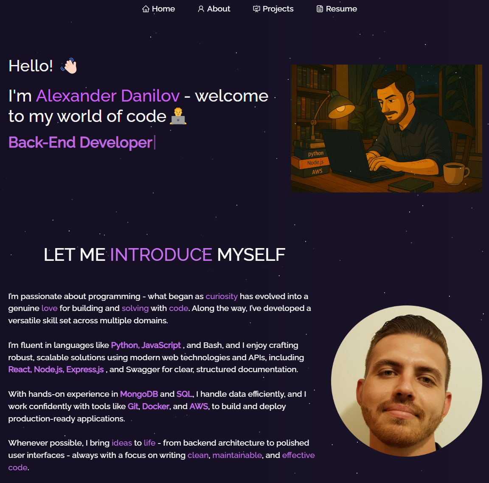

<h2 align="center">
  Alexander Danilov Portfolio - v1.0<br/>
  <a href="https://[your-portfolio-link.com](https://alexander-danilov.vercel.app)" target="_blank">alexdanilov.dev</a>
</h2>

<div align="center">
  
</div>

<br/>

---

## ✨ Overview

This is my personal portfolio website where I showcase my skills, projects, and resume.

Feel free to fork, clone, and customize it for your own use — just give credit by linking back to [Danilov210](https://github.com/Danilov210/Portfolio).

---

## 🛠 Built With

- React.js
- Node.js
- Express.js
- CSS3
- Bootstrap
- Visual Studio Code

---

## 📦 Features

- 📖 Multi-Page Layout (About, Projects, Skills)
- 🎨 Styled with React-Bootstrap and custom CSS
- 📱 Fully Responsive Design

---

## 🚀 Getting Started

### Prerequisites

Make sure you have `git`, `node`, and `npm` installed on your machine.

### Installation

```bash
git clone https://github.com/Danilov210/Portfolio.git
cd Portfolio
npm install


